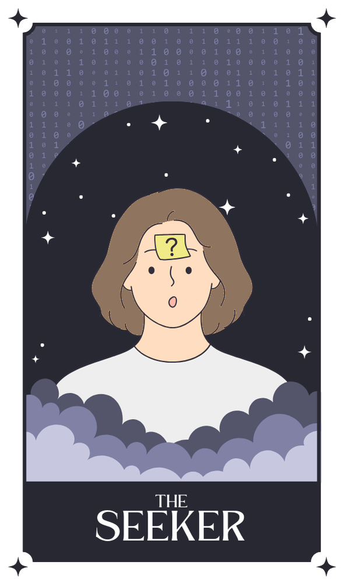

# Card Recycle Bin Feature Proposal

## Overview
Add a playful, interactive "recycle bin" feature to the Tarot Card Game in Hannah's portfolio. This allows visitors to "trash" cards they don't want, retrieve discarded cards for reuse, and see how many cards are in the bin.

## Feature Description

### Core Functionality

1. **Trash Icon on Desktop**
   - Add a "Recycle Bin" icon to the Windows 98 desktop
   - Position it in a corner (e.g., bottom-right like a real Windows desktop)
   - Shows current number of cards in the bin (small badge)

2. **Drag-and-Drop Trashing**
   - Users can drag cards directly to the Recycle Bin icon
   - Cards animate as they're being dragged to the bin
   - Sound effect on drop (e.g., "crumple" sound)

3. **Right-Click Context Menu**
   - Right-click on any card → "Move to Recycle Bin"
   - Option to "Restore" if cards exist in bin
   - Option to "Empty Recycle Bin"

4. **Modified Window State**
   - When cards are "in the bin", they show with slight transparency or grayed-out effect
   - Double-click opens a "Recovered Card" window (modified/expanded state)
   - Cards in bin can be dragged back to desktop (retrieved)

5. **Bin View Window**
   - Click Recycle Bin icon → Opens window showing all cards in bin
   - Cards can be restored to deck (double-click) or dragged to desktop
   - Shows bin count and maybe a list view (thumbnails)
   - "Empty Bin" button to permanently delete all cards

## Visual Design

### Windows 98 Style
- Classic Recycle Bin icon (matching Windows 95/98 aesthetic)
- Same icon style as other desktop icons
- Consistent with existing Windows 98 design language

### Card States
- **Normal Deck**: Card appears normally with full flip animation
- **In Bin**: Card shows with slight transparency or desaturated state
- **Recovered**: Cards show with glow effect when restored from bin

### Animations
- **Trash animation**: Cards shrink and "crumple" when moved to bin
- **Restore animation**: Cards glow/scale up slightly when retrieved
- **Empty bin**: Cards fade out when bin is emptied

## Technical Implementation

### HTML Updates

```html
<!-- Add Recycle Bin Icon to Desktop -->
<div class="icon" id="recycle-bin" data-icon="recycle-bin">
  
  <span class="bin-count" id="bin-count">0</span>
</div>

<!-- Update Tarot Card Markup -->
<div class="tarot-card" data-id="card-1">
  <div class="tarot-card-inner">
    <div class="tarot-card-front">
      
    </div>
    <div class="tarot-card-back">
      <h4>The Seeker</h4>
      <p><b>Hi! I'm Hannah.</b> I'm a software developer with 8+ years of experience...</p>
      <!-- Add drag-hint class -->
      <p class="drag-hint">Drag to desktop or right-click for options</p>
    </div>
  </div>
</div>
```

### CSS Updates

```css
/* Recycle Bin Icon */
#recycle-bin {
  position: absolute;
  bottom: 100px;
  right: 20px;
  z-index: 100;
}

#recycle-bin img {
  width: 48px;
  height: 48px;
}

.bin-count {
  position: absolute;
  top: -8px;
  right: -8px;
  background: #c0c0c0;
  color: #ffffff;
  border-radius: 50%;
  padding: 0 4px;
  font-size: 10px;
  font-weight: bold;
  min-width: 16px;
  text-align: center;
}

/* Drag Hint */
.drag-hint {
  font-size: 10px;
  color: #808080;
  margin-top: 8px;
  text-align: center;
  opacity: 0.8;
}

/* Card States - In Bin */
.tarot-card.in-bin {
  opacity: 0.5;
  filter: grayscale(100%);
}

/* Card States - Recovered */
.tarot-card.recovered {
  box-shadow: 0 0 8px 16px rgba(201, 168, 108, 0.3);
  animation: recoverGlow 1s ease-out;
}

@keyframes recoverGlow {
  0% {
    box-shadow: 0 0 0 0 rgba(201, 168, 108, 0.3);
  }
  100% {
    box-shadow: 0 0 16px 8px rgba(201, 168, 108, 0);
  }
}

/* Trash Animation */
@keyframes trashCard {
  0% {
    transform: scale(1);
  }
  50% {
    transform: scale(0.8);
    filter: brightness(1.2);
  }
  100% {
    transform: scale(0);
    opacity: 0.5;
    filter: grayscale(100%);
    top: 50px;
  left: 50px;
  }
}
```

### JavaScript Implementation

```javascript
// Recycle Bin State Management
const recycleBin = {
  cards: [],
  addToBin: function(cardId) {
    this.cards.push(cardId);
    updateBinCount();
    playSound('trash');
  },
  removeFromBin: function(cardId) {
    const index = this.cards.indexOf(cardId);
    if (index > -1) {
      this.cards.splice(index, 1);
      updateBinCount();
      return true;
    }
    return false;
  },
  restoreCard: function(cardId) {
    const index = this.cards.indexOf(cardId);
    if (index > -1) {
      this.cards.splice(index, 1);
      updateBinCount();
      return true;
    }
    return false;
  },
  emptyBin: function() {
    this.cards = [];
    updateBinCount();
    playSound('empty');
  },
  getCount: function() {
    return this.cards.length;
  }
};

// Update bin count display
function updateBinCount() {
  document.getElementById('bin-count').textContent = recycleBin.getCount();
}

// Sound Effects
const sounds = {
  trash: new Audio('assets/sounds/trash.mp3'),
  recover: new Audio('assets/sounds/recover.mp3'),
  empty: new Audio('assets/sounds/empty.mp3')
};

function playSound(type) {
  if (sounds[type]) {
    sounds[type].play().catch(() => {});
  }
}

// Drag and Drop Handling
document.querySelectorAll('.tarot-card').forEach(card => {
  card.addEventListener('dragstart', function(e) {
    e.dataTransfer.setData('text/plain', 'recycle-bin');
    card.style.transform = 'scale(0.8) rotate(-10deg)';
    card.style.filter = 'brightness(1.2)';
  });

  card.addEventListener('dragend', function(e) {
    if (e.dataTransfer.getData('text/plain') === 'recycle-bin') {
      recycleBin.addToBin(card.dataset.id);
      applyCardInBinState(card);
    }
    card.style.transform = '';
    card.style.filter = '';
    card.style.opacity = '';
  });
});

// Right-Click Context Menu
document.querySelectorAll('.tarot-card').forEach(card => {
  card.addEventListener('contextmenu', function(e) {
    e.preventDefault();

    const menu = document.createElement('div');
    menu.className = 'context-menu';
    menu.innerHTML = `
      <div class="menu-item" data-action="trash">
        
        <span>Move to Recycle Bin</span>
      </div>
      <div class="menu-item" data-action="restore" style="${recycleBin.getCount() > 0 ? '' : 'opacity:0.3;'}">
        <span>Restore from Bin</span>
      </div>
      <div class="menu-item" data-action="empty" style="${recycleBin.getCount() > 0 ? '' : 'opacity:0.3;'}">
        
        <span>Empty Recycle Bin</span>
      </div>
    `;

    menu.style.position = 'absolute';
    menu.style.left = `${e.pageX}px`;
    menu.style.top = `${e.pageY}px`;
    menu.style.zIndex = '10000';

    document.body.appendChild(menu);

    // Handle menu item clicks
    menu.addEventListener('click', function(e) {
      if (e.target.closest('[data-action="trash"]')) {
        recycleBin.addToBin(card.dataset.id);
        applyCardInBinState(card);
      } else if (e.target.closest('[data-action="restore"]')) {
        if (recycleBin.restoreCard(card.dataset.id)) {
          applyRecoveredState(card);
        }
      } else if (e.target.closest('[data-action="empty"]')) {
        recycleBin.emptyBin();
      }

      document.body.removeChild(menu);
    });

    // Close menu when clicking elsewhere
    document.addEventListener('click', function(e) {
      if (!e.target.closest('.context-menu')) {
        document.querySelectorAll('.context-menu').forEach(m => m.remove());
      }
    });
});

// Apply card state styling
function applyCardInBinState(card) {
  card.classList.add('in-bin');
  const inner = card.querySelector('.tarot-card-inner');
  inner.style.transition = 'all 0.3s ease-out';
  inner.style.transform = 'scale(0.8)';
  inner.style.filter = 'brightness(1.2)';
  setTimeout(() => {
    inner.style.opacity = '0.5';
    inner.style.filter = 'grayscale(100%)';
  }, 150);

  playSound('trash');

  setTimeout(() => {
    inner.style.transform = 'scale(0) rotate(-5deg)';
    inner.style.top = '50px';
    inner.style.left = '50px';
  }, 300);
}

function applyRecoveredState(card) {
  card.classList.remove('in-bin');
  card.classList.add('recovered');
  const inner = card.querySelector('.tarot-card-inner');
  inner.style.transition = 'all 0.5s ease-out';
  inner.style.transform = 'scale(1.05)';
  inner.style.filter = 'none';
  inner.style.boxShadow = '0 0 8px 16px rgba(201, 168, 108, 0.3)';
  playSound('recover');

  setTimeout(() => {
    inner.style.transform = '';
    inner.style.boxShadow = '';
  }, 300);
}
```

## Assets Needed

- Recycle Bin Icon (48x48px) - Windows 98 style
- Empty Bin Icon
- Sound effects (optional, can be skipped if no audio files):
  - trash.mp3 (paper crumple/deletion sound)
  - recover.mp3 (magical chime)
  - empty.mp3 (whoosh sound)

## Integration with Existing Features

This feature integrates seamlessly with the existing Windows 98 desktop:
- Recycle Bin icon appears on desktop
- Right-click menu adds to existing card interaction
- Bin count badge shows current number of discarded cards
- Drag-and-drop uses existing animation framework
- Visual feedback matches Windows 98 aesthetic

## Benefits

1. **Playful & Memorable** - Adds game-like interactivity to portfolio
2. **On-brand** - Fits perfectly with Windows 98 desktop metaphor
3. **User-friendly** - Natural "undo" metaphor (can recover cards)
4. **Showcases creativity** - Demonstrates attention to micro-interactions
5. **Conversation starter** - "Hey, I notice you have a recycle bin for cards..." - fun icebreaker!

## Implementation Notes

- The feature is backward compatible (existing cards continue to work)
- All animations use CSS transitions for smooth performance
- Sound effects are optional (feature works without them)
- Recycle bin state is stored in memory (simple JavaScript object)

## Future Enhancements (Optional Ideas)

- Animated bin icon that "bounces" when cards are added
- "Shake" animation on cards before dragging to bin
- Bin window with thumbnail view of all cards
- Undo button to restore last trashed card
- "Empty All" option with confirmation dialog

---

**This feature adds playful interactivity while demonstrating attention to micro-interactions and user experience design — perfect for a creative XR developer portfolio!**
